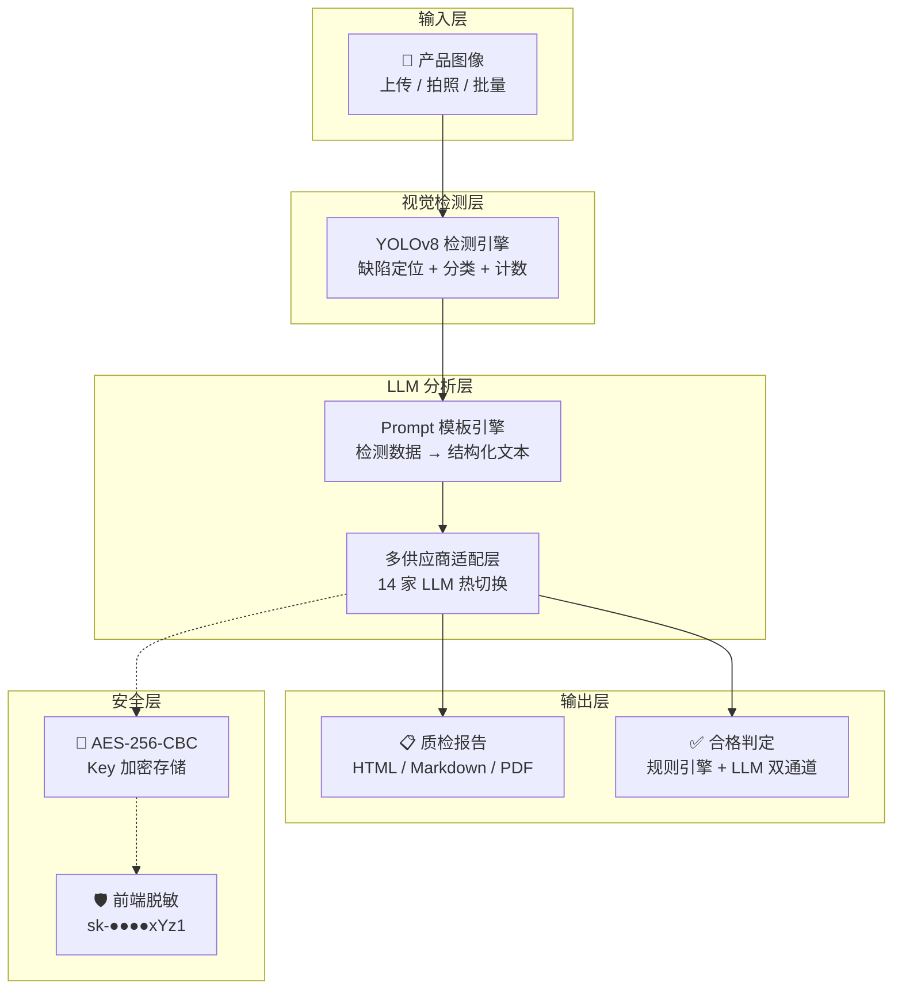
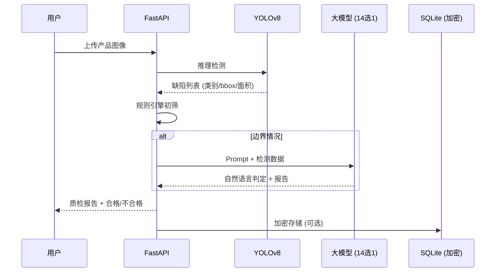

# 智能视觉报告生成与多模态质检系统

YOLOv8 目标检测 → 大模型语义分析 → 结构化质检报告 + 合格判定。一条链路打通计算机视觉与大语言模型。

## 系统架构



## 数据流



## 14 家 LLM 供应商

| # | 供应商 | 默认模型 | 费用 |
|---|--------|---------|------|
| 1 | OpenAI | gpt-4o-mini | $0.15/1M tokens |
| 2 | Anthropic Claude | claude-haiku-4-5 | $0.80/1M |
| 3 | DeepSeek | deepseek-chat | ¥1/1M |
| 4 | 通义千问 (Qwen) | qwen-turbo | 部分免费 |
| 5 | Ollama 本地 | qwen3:4b | 完全免费 |
| 6 | 智谱 AI (GLM) | glm-4-flash | 免费 |
| 7 | 百度文心 (ERNIE) | ernie-speed-128k | 免费 |
| 8 | 讯飞星火 (Spark) | spark-lite | 免费 |
| 9 | 腾讯混元 (Hunyuan) | hunyuan-lite | 免费 |
| 10 | 月之暗面 (Kimi) | moonshot-v1-8k | ¥0.012/1K |
| 11 | MiniMax (ABAB) | abab6.5s-chat | ¥0.001/1K |
| 12 | 百川智能 (Baichuan) | baichuan4 | ¥0.001/1K |
| 13 | 零一万物 (Yi) | yi-large | ¥0.025/1K |
| 14 | 字节豆包 (Doubao) | doubao-lite-128k | ¥0.0008/1K |

全部 OpenAI-compatible，一个适配层全覆盖。Web 管理页可视化配置 + 测试连接。

## 安全架构

| 机制 | 实现 |
|------|------|
| AES-256-CBC 加密 | API Key 落库前加密，密钥 PBKDF2 派生 |
| 前端脱敏 | `sk-aB3x●●●●xYz1`，点击眼睛才显示 |
| .gitignore 防护 | `*.db` + `.env` 已在忽略列表 |
| SSRF 防护 | LLM 请求前校验 URL，屏蔽内网/回环地址 |

## 项目结构

```
vision-inspection-report/
├── app/
│   ├── main.py                     # FastAPI 入口（lifespan 预热 YOLO）
│   ├── core/
│   │   ├── config.py               # Pydantic Settings
│   │   ├── crypto.py               # AES-256-CBC 加密
│   │   └── key_manager.py          # 14 家供应商管理
│   ├── engine/
│   │   ├── detector.py             # YOLOv8 检测引擎
│   │   ├── llm_adapter.py          # 多 LLM 适配层
│   │   ├── prompts.py              # Prompt 模板引擎
│   │   ├── report_builder.py       # HTML/Markdown 报告渲染
│   │   └── quality_checker.py      # 双通道判定（规则+LLM）
│   ├── services/
│   │   └── inspection_service.py   # 核心业务编排
│   ├── api/
│   │   └── routes.py               # REST API
│   └── static/
│       └── index.html              # Web 界面
├── outline.html                    # 项目设计大纲
├── Dockerfile
└── requirements.txt
```

## 快速开始

### 1. 安装

```bash
cd vision-inspection-report
pip install -r requirements.txt
cp .env.example .env
```

### 2. 启动

```bash
python -m uvicorn app.main:app --host 0.0.0.0 --port 8000
```

### 3. 使用

浏览器打开 `http://localhost:8000`：

1. 点击 **模型配置** → 选择供应商 → 填入 API Key → 保存 → 测试连接
2. 点击 **检测报告** → 上传产品图像 → 选择操作

### API 端点

| 方法 | 路径 | 说明 |
|------|------|------|
| GET | `/api/v1/health` | 健康检查 |
| POST | `/api/v1/detect` | YOLO 检测 |
| POST | `/api/v1/generate-report` | 检测 + LLM 报告生成 |
| POST | `/api/v1/quality-check` | 检测 + 合格判定 |
| GET | `/api/v1/providers` | 14 家供应商列表 |
| GET | `/api/v1/providers/{name}` | 供应商详情 |
| POST | `/api/v1/providers/{name}` | 保存 API Key |
| POST | `/api/v1/providers/{name}/test` | 测试连接 |

### Docker 部署

```bash
docker build -t vision-inspection .
docker run -p 8000:8000 vision-inspection
```

## 技术栈

| 层级 | 技术 |
|------|------|
| 视觉检测 | YOLOv8 (ultralytics) + ONNX Runtime |
| LLM 调用 | OpenAI SDK (14 家兼容) |
| Web 框架 | FastAPI + uvicorn |
| 加密 | AES-256-CBC + PBKDF2 |
| 配置 | Pydantic Settings |
| 日志 | Loguru |
| 前端 | 原生 HTML/JS (零依赖) |
| 部署 | Docker |

## License

MIT
